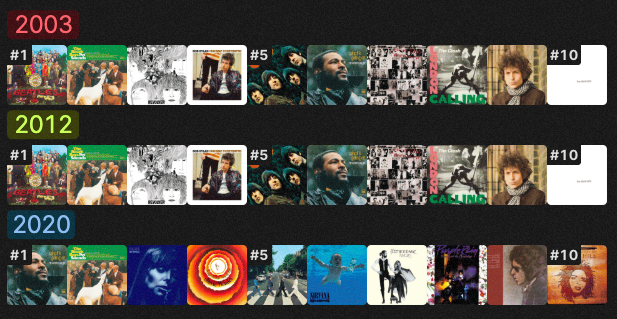
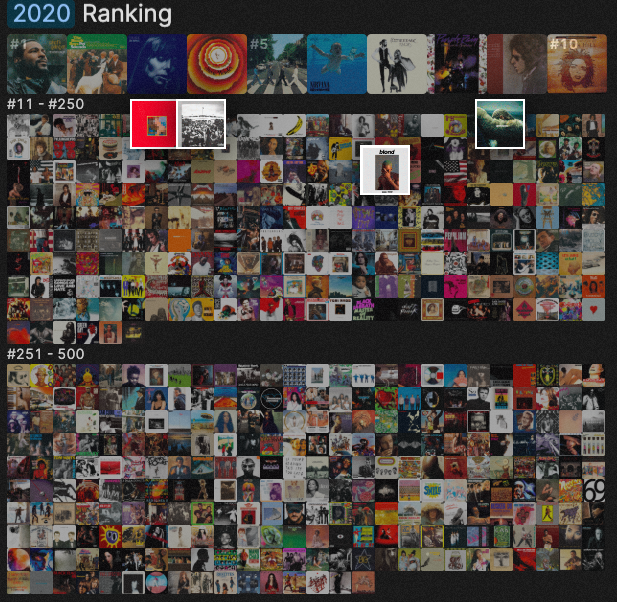

## Análisis de webstory: What Makes an Album the Greatest of All Time?

La webstory analiza qué factores influyen en que un álbum sea considerado uno de los mejores de todos los tiempos. Para hacerlo, toma como punto de partida las listas de los 500 mejores álbumes de Rolling Stone, principalmente sus versiones de 2003 y 2020.

A partir de los cambios entre ambos rankings, los autores estudian factores como la evolución en las formas de consumir música, la popularidad de los discos y las características de las personas que participaron en las votaciones. La historia busca entender por qué álbumes que en un determinado momento fueron considerados entre los mejores pueden cambiar de posición o desaparecer de la lista con el paso de los años.

La webstory se enfoca en comparar qué discos aparecen en cada ranking y utiliza esas diferencias para analizar cómo puede cambiar la percepción de lo que se considera “la mejor música”. A través de distintos datos, los autores muestran que pueden estar relacionados con el contexto de cada época, los cambios en los formatos y las personas encargadas de realizar la selección.

Parte con una comparación sencilla mostrando cómo cambió el ranking de Rolling Stone entre sus distintas ediciones. Los Top 10 de 2003 se mantuvieron prácticamente igual a los de 2012 y en 2020 presentó cambios importantes. Este contraste funciona como el gancho de la historia y permite plantear la pregunta de la webstory.

Esta imagen, por ejemplo, va mostrando la evolución del Top 10, aparece progresivamente, terminan uno encima del otro y es muy útil para ver los cambios que tiene cada año.

Esta imagen igual muestra algunos de los cambios haciendo zoom en ellos.

En general, los apoyos visuales de la webstory permiten identificar qué álbumes se han mantenido, cuáles cambian de posición y cuáles desaparecen, haciendo mucho más evidente la transformación. 

Al hacer scroll la historia se va desarrollando y no requiere de más interacciones. Considero que funciona bien porque existe un orden en que se ve la información y mantiene al usuario “entretenido” de cierta forma porque va cambiando todo cada vez que uno va avanzando.

Además, existe un buen equilibrio entre texto e imágenes. Los párrafos son breves y las imágenes ocupan gran parte de la pantalla, por lo que el texto funciona como guía para interpretar lo que se está mostrando. 

En cuanto a la calidad de los datos destacaría que usaron el ranking original de Rolling Stone de un archivo de internet y además tuvieron acceso a la revista original de 2003. Además, los datos son claros, al igual que el análisis que hacen de ellos. También se preocupan de explicar de dónde proviene la información utilizada y de verificar que los rankings correspondan efectivamente a las versiones que están comparando. 

Considero que la webstory transmite la información de manera efectiva porque logra transformar una pregunta que puede parecer más subjetiva en una historia que puede ser explorada mediante datos. 

Lo que más destaco es la forma en que se muestra la información y el uso de las imágenes. Se encargaron de tener la portada de cada álbum para construir las distintas partes, al igual que las imágenes de cada jurado. Creo que eso hace la diferencia al momento de querer leer la webstory y ayuda a comprender cada punto que se presenta. 

Por último, la forma de interacción elegida funciona bien para este tipo de historia. Aunque el usuario no tiene que realizar muchas acciones aparte de hacer scroll o apretar algunos elementos, estos van cambiando a medida que se avanza la lectura y permite descubrir los datos progresivamente y entender las comparaciones sin enfrentarse a toda la información al mismo tiempo. 